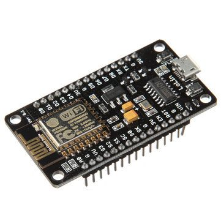
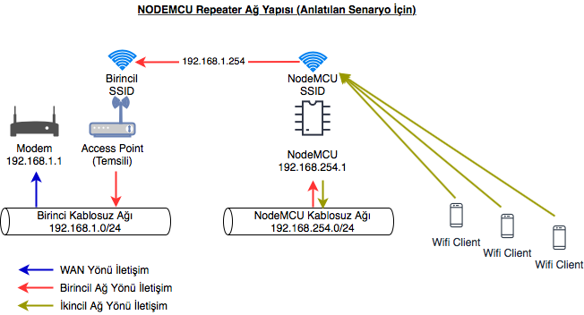
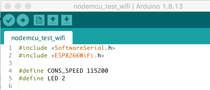
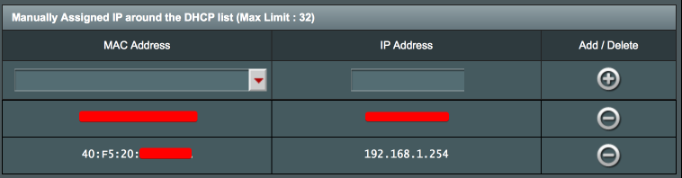
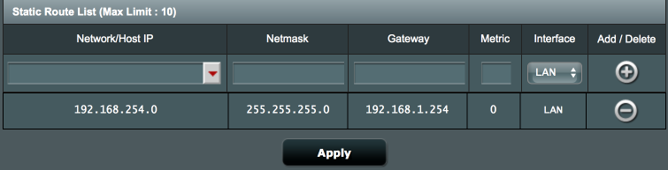

## NodeMCU ESP8266 Wifi Extender / Kablosuz Ağ Çoklayıcı / Güçlendirici

Merhabalar,
 Birçok yerden parça parça toplayıp extenderımı tamamladığım bu projemi faydalı olması dileğiyle türkçe olarak paylaşıyorum
 Adım adım izleyerek sizde uygun maliyette olan bu arduino modülü ile wifi ağınızı genişletebilirsiniz diye düşünüyorum.
 Son olarak; bu modülü kullanarak yaptığım speed testlerinde hızın 3Mbit civarında olduğunu gördüm. Bu yapının basit veri iletişimlerinde başarılı fakat streaming tipi iletişimlerde yetersiz kalması anlamına gelmektedir.
 <i>ENG: Hello there,
 I share this project and I hope it will be useful.
 By following step by step, I think you can expand your wifi network with this arduino module, which is affordable.
 Finally; In the speed tests I made using this module, I saw that the speed was around 3Mbit. This means that this structure is successful in simple data communications but  insufficient in streaming type communications.</i>
  
  
  
### Hazırlık; (Preperation)
- Arduino IDE nizi hazırlayın
 <i>ENG: Please prepare your Arduino IDE</i>
- NodeMCU Windows/mac/linux driverından ilgili olanı yükleyin (bağlantı için olmazsa olmaz olabiliyor..)
 <i>ENG: Install the relevant NodeMCU Windows, mac or linux driver (maybe it can be essential for connection ..)</i>

### Ağ Yapısı; (Network Map)

### Başlıyoruz; (Here We Go)
- IDEnizi aşağıdaki kodu yapıştırın ve "*" kullanılan değerleri lütfen kendinize göre düzenleyin
 <i>ENG: Paste the code below in your IDE and edit the values used "*" according to yours.</i>

~~~
#include <SoftwareSerial.h>
#include <ESP8266WiFi.h>

#define CONS_SPEED 115200 //* eger daha onceden baglanti hizini degistirdiyseniz

//Evdeki/Mevcut AP Cihazin Bilgileri
const char* client_ssid     = "SSID";  //*
const char* client_password = "SIFRE"; //*
const char* esp_hostname = "CLIENT_HOSTNAME"; //* Evdeki/Mevcut APye katilacak cihaza bir isim verin
//Olusturulacak Yazilimsal AP Bilgileri
const char* server_ssid     = "SOFT_AP"; //*
const char* server_password = "SIFRE"; //*
int server_channel = 11; //* Optional
IPAddress local_IP(192,168,254,1); //* Yazilimsal AP IP Adresi
IPAddress subnet(255,255,255,0); //* Yazilimsal AP Subnet
IPAddress gateway(192,168,254,1); //* Yazilimsal AP IP Ag Gecidi

void setup() {
  Serial.begin(CONS_SPEED);

  Serial.println("");
  Serial.println("Device Started..");
  //Bu bolumde evdeki/mevcut APye katilim baslar
  WiFi.mode(WIFI_AP_STA);
  Serial.print("Connecting to ");
  Serial.print(client_ssid);
  Serial.print(" : ");
  Serial.println(WiFi.begin(client_ssid, client_password) ? "Ready" : "Failed!");
  Serial.print("Waiting ap initialization..");
  while (WiFi.status() != WL_CONNECTED) {
    WiFi.hostname(esp_hostname);
    delay(500);
    Serial.print(".");
  }
  Serial.println(" Device Ready ...");
  Serial.print("WiFi connected, IP address : ");
  Serial.println(WiFi.localIP());
  //Bu bolumde Yazilimsal AP olusturulup yayin yapmaya baslar
  Serial.print("Soft-AP Creating ... ");
  WiFi.softAPConfig(local_IP, gateway, subnet);
  Serial.println(WiFi.softAP(server_ssid, server_password, server_channel) ? "Ready" : "Failed!");
  Serial.print("Soft-AP Created, IP address : ");
  Serial.println(WiFi.softAPIP());

  Serial.println("Operation Ended .");
}

void loop() {}
~~~

- IDE vasıtasıyla kodu derleyip cihaza yükleyin
 <i>ENG: Compile the code via IDE and upload it to the device</i>

### Mevcut AP veya Modeminizde (on the Current Modem or AP Configuration);
- DHCP ayarlarına girip yazılımsal ap cihazın ip adresini 192.168.1.254 olarak sabitleyin.
 <i>ENG: Enter the DHCP settings and make to static the ip address of the software ap device as 192.168.1.254.</i>
- 
- Yazılımsal AP cihazının oluşturduğu wifi ağı için kullandığı ip aralığı 192.168.254.1-254 dür. 
 Bu aralık erişilebilir olması ve bu aralıkta alınan adresin modeme erişebilmesi için routing eklenmesi gerekmektir. 
 Bu ayarı Network 192.168.254.1, Subnet Mask 255.255.255.0 Gateway 192.168.1.254 şeklinde tanımlayın.
 <i>ENG: The IP range used by the software AP device for the wifi network created is 192.168.254.1-254.
 In order for this range to be accessible routing must be added to modem.
 Define the address as : Network 192.168.254.1, Subnet Mask 255.255.255.0 Gateway 192.168.1.254.</i>

Artık Yazılımsal APnize bağlantı yaptığınızda internete erişebileceğinizi göreceksiniz..
 <i>ENG: Now is the time to see that the internet is accessible..</i>

### Hata veya erişim sorunlarında (for error or another accessible problems)
Bağlantının çalışmaması durumunda Arduino IDE üzerinden seri port ekranı vasıtası ile çıktıları kontrol edebilirsiniz.
 Routing önemlidir, doğru şekilde yaptığınıza emin olun. Ayrıca erişim kontrollerini pingler ile sağlayabilirsiniz.
 Bazı modem yada firewall tarzı cihazlarda wifi isolation, dos koruması vb. güvenlik önlemleri bulunabilir buda sizin bağlantınızın çalışmamasına sebep olabilir.
 <i>ENG: In case the connection does not work, you can check the outputs via the serial port screen on the Arduino IDE.
 Routing is important, make sure you do it correctly. You can also provide access controls with pings.
 In some modem or firewall-style devices, wifi isolation, dos protection, etc. security measures can be found. This may cause your connection to not work.</i>
